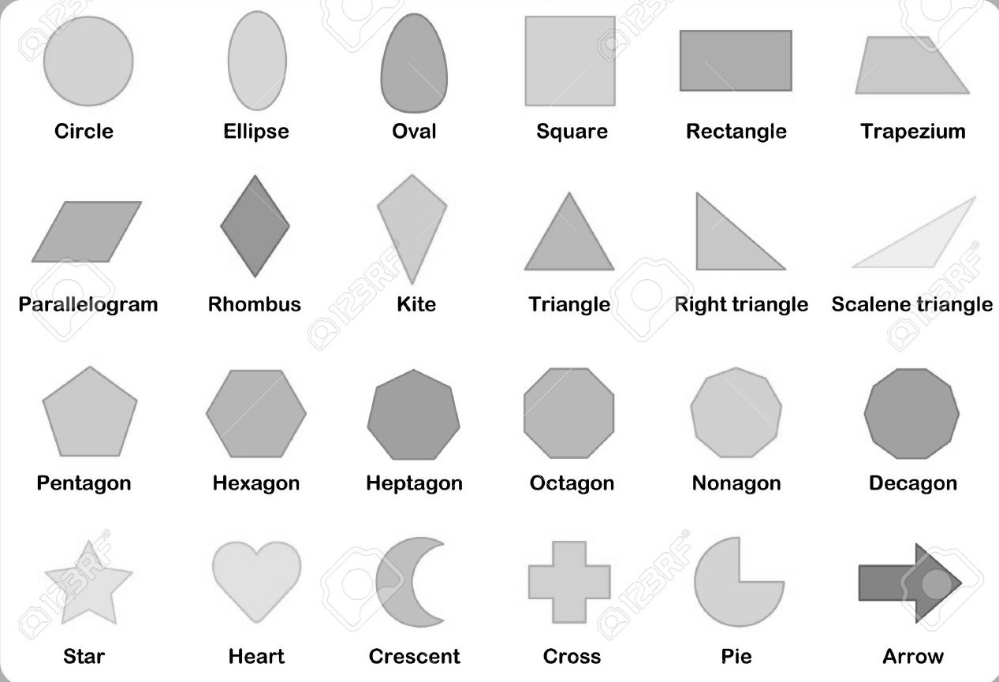
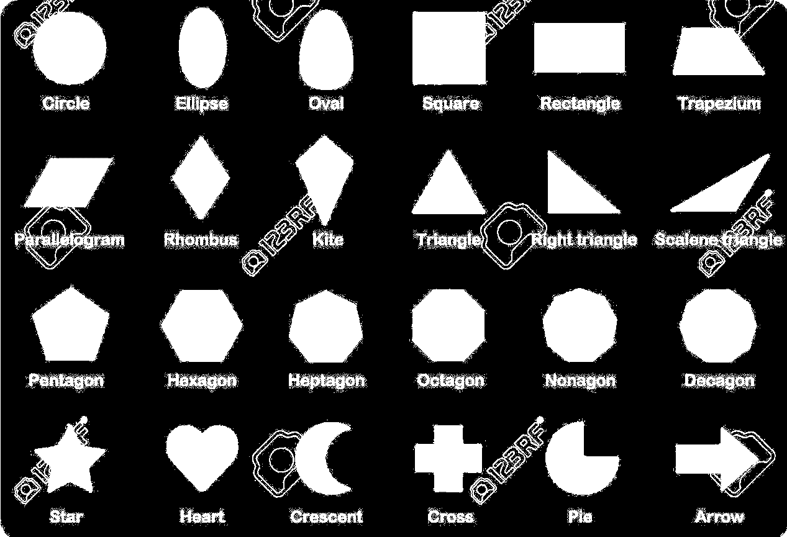
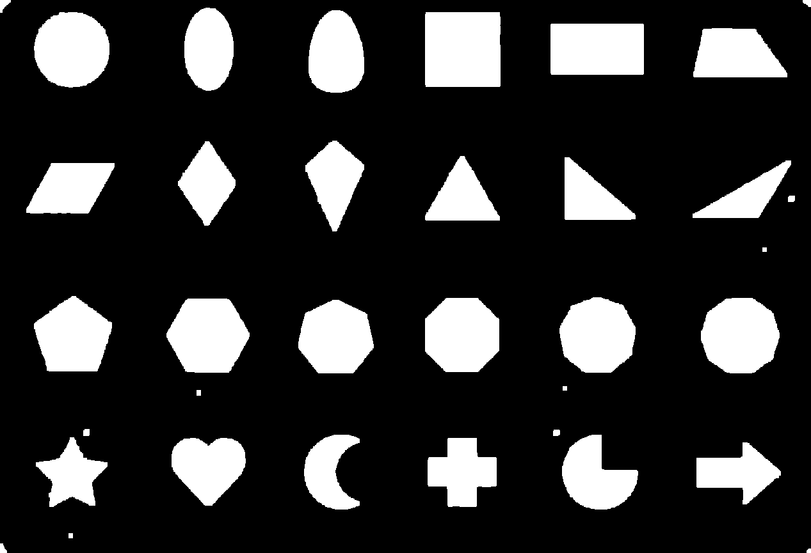
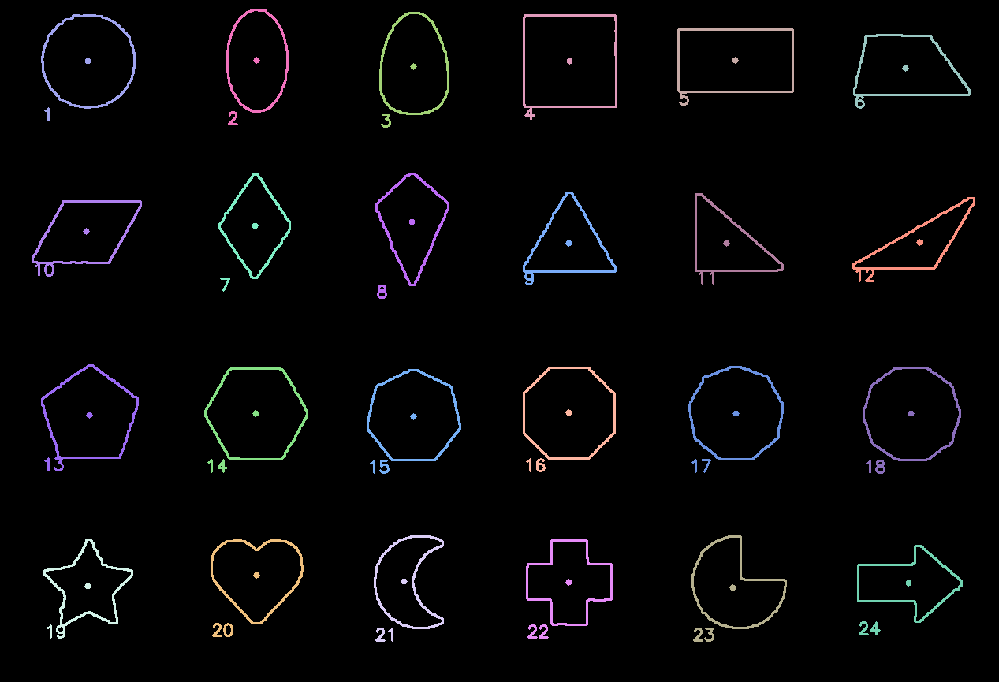
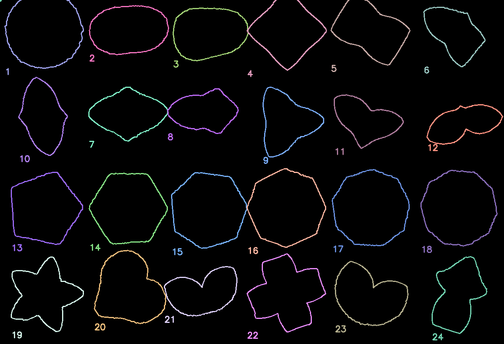

# Shapes Project

This project uses CMake for building. Follow these steps to compile and run:

### **Prerequisites**

- CMake (>= 3.1)
- A C++ compiler (GCC, Clang, or MSVC)
- OpenCV

### **Build Instructions**

1. **Clone the repository:**
   ```bash
   git clone https://github.com/JFaustoGC/shapes.git
   cd shapes
   ```
2. **Create a build directory:**
    ```bash
    mkdir build && cd build
    ```

3. **Configure and build:**
   ```bash
   cmake ..
   make
   ```

4. **Run the executable:**
   ```bash
   ./figuras
   ```

## Core Classes Overview

This document outlines the main classes of the figure processing system, which allows extracting, representing,
comparing, and storing geometric figures from image data or files.

---

### `Figure`

```cpp
class Figure {
    std::vector<cv::Point> contour;
    cv::Moments moments;
    cv::Point centroid;
    std::string name;
    std::vector<double> bof;

    static constexpr int BOF_SIZE = 180;

public:
    explicit Figure(const std::vector<cv::Point>& contour, std::string name);
    explicit Figure(const std::vector<double>& bof, std::string name, cv::Point centroid);

    const Figure& find_closest(const std::vector<Figure>& figures) const;

    const cv::Point& get_centroid() const;
    const std::vector<cv::Point>& get_contour() const;
    const std::string& get_name() const;

    std::vector<double> find_bof() const;

    bool operator<(const Figure& other) const;
};
```

The Figure class represents a geometric shape defined by its contour, centroid, and a descriptor vector called BoF (
Boundary-Origin Function). Contrary to its acronym, BoF here refers to the radial distance from the figure's centroid to
its boundary at fixed angular intervals (e.g. every 2° for 180 samples), capturing the shape's geometry.

Two constructors are provided:

From a contour and name: the centroid and BoF are computed automatically.

From a BoF vector, centroid, and name: typically used when loading stored representations.

The class provides methods to compute its BoF, access its properties, and find the most similar figure (based on L2 norm
between BoFs) from a collection.

```c++
ImageFigureProvider
cpp
Copy
Edit
class ImageFigureProvider : public FigureProvider {
public:
    std::vector<Figure> get_figures(const cv::Mat& ref_image, int quantity) override;

private:
    static cv::Mat convert_to_grayscale(const cv::Mat& input);
    static cv::Mat apply_threshold(const cv::Mat& gray_image);
    static cv::Mat apply_morphology(const cv::Mat& binary_image);
    static std::vector<std::vector<cv::Point>> find_sorted_contours(const cv::Mat& image, int quantity);
    static std::vector<Figure> convert_to_figures(const std::vector<std::vector<cv::Point>>& contours);

    static constexpr int THRESHOLD_VALUE = 250;
    static constexpr int FILTER_SIZE = 3;
    static constexpr int ITERATIONS = 3;

    static const std::vector<std::string> names;
};
```

The ImageFigureProvider is responsible for extracting figures from a given image. It performs the following processing
pipeline:

Grayscale Conversion – simplifies image content.

Thresholding – produces a binary image separating foreground and background.

Morphological Operations – cleans the binary image to improve contour detection.

Contour Detection – finds and sorts external contours by area.

Figure Conversion – creates Figure instances from the top quantity contours.

This provider is used when the source of figures is an image containing multiple shapes.

```c++
CsvFigureProvider
cpp
Copy
Edit
class CsvFigureProvider : public FigureProvider {
static constexpr int bof_size = 180;

public:
explicit CsvFigureProvider(std::string filename);

    std::vector<Figure> get_figures(const cv::Mat& ref_image, int quantity) override;
    void save_figures(const std::vector<Figure>& figures) const;
    bool file_exists() const;

private:
std::string filename;
static constexpr int BOF_SIZE = 180;
};
```

The CsvFigureProvider enables reading and writing figure data to and from a CSV file. It is mainly used for:

Persisting a collection of figures, storing their names, BoF descriptors, and centroids.

Loading precomputed BoF-based figures from disk without requiring reprocessing of the original image.

This class allows for easy integration with external tools or manual annotation workflows.

Together, these classes define a modular and extensible pipeline for figure extraction, representation, comparison, and
storage based on radial distance descriptors from centroid to boundary.

## Methodology

The following steps illustrate the image processing pipeline implemented in `ImageFigureProvider`. This sequence
transforms the original image into a set of recognizable shapes:

1. **Grayscale Conversion**  
   The input image is first converted to grayscale to simplify the data and reduce computational complexity.  
   

2. **Thresholding**  
   A binary threshold is applied to distinguish foreground shapes from the background.  
   

3. **Morphological Transformations**  
   Morphological operations (e.g., erosion and dilation) are used to clean up the binary image, removing small
   artifacts, and filling gaps.  
   

4. **Contour Detection and Sorting**  
   The contours are extracted, sorted by area, and the largest ones are selected and converted into shape objects.  
   

5. **BOF Extraction**  
   From each identified figure, a Bag-of-Features (BOF) vector is extracted, which represents the distance from the
   centroid to the contour at uniformly sampled angles.  
   

6. **Shape Matching**  
   The test image is then processed using the same pipeline: grayscale conversion, thresholding, morphology, contour
   detection, and BOF extraction. The resulting BOF vector is compared to the stored ones to find the closest match
   based on Euclidean distance.

   ```commandline
   Figure: circle           | Distance: 3.99832
   Figure: ellipse          | Distance: 2.91195
   Figure: oval             | Distance: 2.46349
   Figure: square           | Distance: 2.77508
   Figure: rectangle        | Distance: 3.12007
   Figure: trapezium        | Distance: 2.80772
   Figure: rhombus          | Distance: 2.57886
   Figure: kite             | Distance: 3.36759
   Figure: triangle         | Distance: 0.52650
   Figure: parallelogram    | Distance: 2.85581
   Figure: right triangle   | Distance: 2.29107
   Figure: scalene triangle | Distance: 3.84007
   Figure: pentagon         | Distance: 3.04455
   Figure: hexagon          | Distance: 3.37883
   Figure: heptagon         | Distance: 3.68625
   Figure: octagon          | Distance: 3.78749
   Figure: nonagon          | Distance: 3.89747
   Figure: decagon          | Distance: 3.77291
   Figure: star             | Distance: 2.81078
   Figure: heart            | Distance: 3.27744
   Figure: crescent         | Distance: 3.84788
   Figure: cross            | Distance: 3.30488
   Figure: pie              | Distance: 2.39407
   Figure: arrow            | Distance: 2.85595
   ```